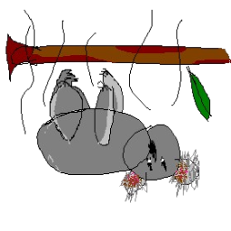

<p align="center">
  
  <h1 align="center">dropbear</h1>
</p>

dropbear is a game engine used to create games, made in Rust and scripted with the Kotlin Language.

Its name is a double entendre, with it being the nickname of koalas but also fits in nicely with the theme of rust utilising memory management with "drops".

If you might have not realised, all the crates/projects names are after Australian items.

## Projects

- [dropbear-engine](https://github.com/tirbofish/dropbear/tree/main/crates/dropbear-engine) is the rendering engine that uses wgpu and the main name of the project.
- [eucalyptus-editor](https://github.com/tirbofish/dropbear/tree/main/crates/eucalyptus-editor) is the visual editor used to create games visually, taking inspiration from Unity, Unreal, Roblox Studio and other engines.
- [eucalyptus-core](https://github.com/tirbofish/dropbear/tree/main/crates/eucalyptus-core) is the library used by both `redback-runtime` and `eucalyptus-editor` to share configs and metadata between each other.
- [redback-runtime](https://github.com/tirbofish/dropbear/tree/main/crates/redback-runtime) is the runtime used to load .eupak files and run the game loaded on them.
- [magna-carta](https://github.com/tirbofish/dropbear/tree/main/crates/magna-carta) is a rust library used to generate compile-time Kotlin/Native and Kotlin/JVM metadata for searching.
- [kino-ui](https://github.com/tirbofish/dropbear/tree/main/crates/kino-ui) is the main runtime-side UI system to render widgets and elements. 

[//]: # (- [eucalyptus-sdk]&#40;https://github.com/tirbofish/dropbear/tree/main/eucalyptus-sdk&#41; is used to develop plugins to be used with the `eucalyptus-editor`)

### Related Projects

- [dropbear_future-queue](https://github.com/tirbofish/dropbear/tree/main/dropbear_future-queue) is a handy library for dealing with async in a sync context
- [model_to_image](https://github.com/tirbofish/model_to_image) is a library used to generate thumbnails and images from a 3D model with the help of `russimp-ng` and a custom made rasterizer. _(very crude but usable)_
- [slank](https://github.com/tirbofish/dropbear/tree/main/crates/slank) is a slang compiler that compiles .slang files into shaders during build.rs compilation time.

## Build

<details>
<summary>Windows</summary>

Required dependencies: 
- JDK 21
- assimp is automatically dealt with during build
- the latest rustc
- windows sdk/visual studio of some sort

yeah thats about it

</details>

<details>

<summary>Linux</summary>

With Unix systems (macOS not tested), you will have to download a couple of dependencies if building locally:

```bash
# ubuntu
sudo apt install libudev-dev pkg-config libssl-dev clang cmake meson assimp-utils openjdk-21-jdk

# i use arch btw
sudo pacman -Syu base-devel systemd pkgconf openssl clang cmake meson assimp jdk21-openjdk

```

</details>

<details>

<summary>macOS</summary>

If you have a macOS system, please create a PR and add your own implementation. I am unfortunately broke
and do not own any sort of macOS system. 

</details>

To build, ensure build requirements, clone the repository, then build it. It will build in debug mode, and use a lot 
of packages, so if your CPU is not fast enough for building you should brew a cup of coffee during the build time or 
scroll through Instagram Reels. (you could get a nice doomscroll in.)

Then run this to build the project

```bash
git clone git@github.com:tirbofish/dropbear
cd dropbear

# eucalyptus-editor requires dropbear-1.0-SNAPSHOT-all.jar to be built first
./gradlew shadowJar
# this will build all the projects in the workspace
cargo build
```

[//]: # (# ensure submodules are checked-out)

[//]: # (git submodule init)

[//]: # (git submodule update)

> [!TIP]
> It is recommended to use IntelliJ IDEA with the Rust plugin to help contribute to the engine. 
> 
> If you are a normal joe, then just use the standard IntelliJ IDEA.

<details>

<summary>For the engine developers</summary>

Ensure that `cargo build` is ran for each iteration of testing instead of `cargo build -p eucalyptus-editor` due to some weird ABI issue with Rust. If you do only want to build
a specific package, ensure you run `cargo build -p {package} -p eucalyptus-core`. 

If you get any FFI errors (likely a getter), you compiled the library wrong. 

</details> 

### Prebuilt

If you do not want to build it locally, you are able to download the latest action build (if no releases have been made).

[nightly.link](https://nightly.link/tirbofish/dropbear/workflows/create_executable.yaml/main?preview)

## Usage

Despite the dropbear-engine (and other components) being made in Rust, the editor has chosen the scripting language of choice to be `Kotlin`
because of previous experience and that Kotlin is more multiplatform than Swift. 

The dropbear engine uses Kotlin Multiplatform, which allows the cooked up product to be compatible with all platforms 
KMP can support, which includes mobile, WASM and desktop. Because the editor is only available on desktop, the JVM is 
used to evaluate the scripts as it allows for hot-reloading (not made yet).

The dropbear engine does not support any Java code (for class scripting) as it won't be read by the magna-carta parser. 
Java libraries are still fine, and java classes work, but cannot be annotated by the parser, and only works
on the JVM target. You can customise the build.gradle.kts file in your project to your own likings. 

## Documentation

API documentation and articles are available at [tirbofish.github.io/dropbear](https://tirbofish.github.io/dropbear). 

## Compability

|            | Windows | macOS | Linux | Web | Android | iOS |
|------------|---------|-------|-------|-----|---------------|---------------|
| eucalyptus | ✅       | ✅     | ✅  | ❌ | ❌ | ❌ |
| redback    | ✅       | ✅     | ✅  | ❌ | ❌ | ❌ |

<!-- <sup>1</sup> Will never be implemented; not intended for that platform.

<sup>2</sup> Made some progress on implementing, but currently a WIP. -->

## Contributions

Yeah, yeah, go ahead and contribute. Make sure it works, and its not spam, and any tests pass.

# Licensing

All projects made in this repository is under the license of MIT or Apache 2.0 depending on your choice. 

It is recommended that you give us (the engine) credit, as it allows for more community support. This could be
in the form of a credit scene or in the splash screen. 
